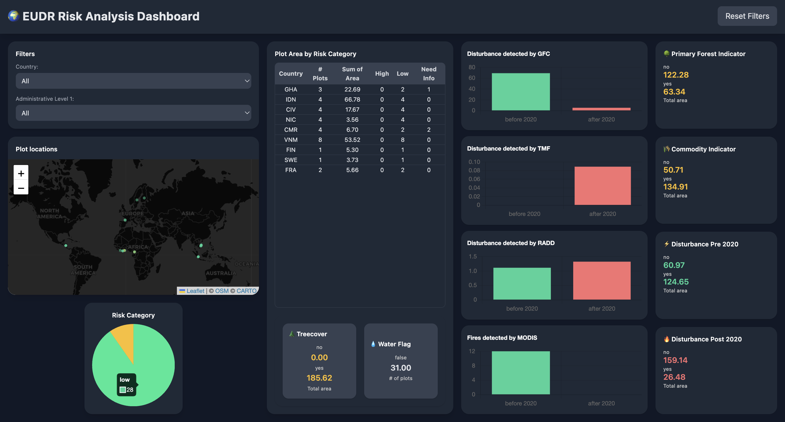

# EUDR Risk Analysis Dashboard

An interactive web-based dashboard for visualizing global risk plots and environmental indicators.  
Users can filter data by country and administrative levels, view maps, pie charts, bar charts, and summary indicators, and even upload their own datasets.

---
## View of the Dashboard



---
## Features

### Custom Data Upload
- Upload a **CSV dataset** with the same schema as the default.  

### Interactive Filters
- Filter data by **country** and **administrative level**.  
- Filters are dynamic: selecting a country updates available admin-level options.

### Reset Filters
- Reset all filters and view the full dataset.


### Map Visualization
- **Leaflet-based map** showing plot locations with risk-colored markers.

### Charts
- **Pie chart** showing risk category distribution  
- **Bar charts** for:
  - GFC loss
  - TMF deforestation
  - RADD
  - MODIS fire indicators

### Indicators
- Summary cards for:
  - Treecover  
  - Water body flags  
  - Primary forest  
  - Commodities  
  - Disturbances  

---

## Getting Started

### Prerequisites
- No installation required — runs in any **modern web browser**.  
- Internet connection is needed to load external libraries:
  - D3.js
  - Chart.js
  - Leaflet
  - Tailwind CSS

### Default Dataset
- Included as **`whisp_sample_data_global.csv`**  
- Expected schema (columns):

```csv
Country
Admin_Level_1
Centroid_lat
Centroid_lon
Area
risk_pcrop
Ind_01_treecover
Ind_02_commodities
Ind_03_disturbance_before_2020
Ind_04_disturbance_after_2020
Ind_05_primary_2020
GFC_loss_before_2020
GFC_loss_after_2020
Ind_tmf_before_2020
TMF_def_after_2020
RADD_before_2020
RADD_after_2020
MODIS_fire_before_2020
MODIS_after_before_2020
In_waterbody
plotId
```

## Usage

1. Clone or download the repository.  
2. Open  this link [WHISP Dashboard](nicolevasos.github.io/WHISP-Dashboard/) or **`index.html`** in a web browser.  
3. On first load, choose either:
   - Load the default dataset, or  
   - Upload a custom CSV file with the same schema.  
4. Use the filters on the left sidebar to explore the data.  
5. Reset filters using the **"Reset All Filters"** button.  

---
## File Structure

```
├── README.md                          # Project documentation
├── index.html                         # Main entry point for the dashboard
├── dashboard.js                       # Core logic: filters, charts, map, indicators
├── style.css                          # Custom styling overrides
└── data/
    └── whisp_sample_data_global.csv   # Default dataset used on startup
```
---
## Libraries Used

- [D3.js v7](https://d3js.org/) – Data manipulation and tables  
- [Chart.js](https://www.chartjs.org/) – Pie and bar charts  
- [Leaflet.js](https://leafletjs.com/) – Interactive map  
- [Tailwind CSS](https://tailwindcss.com/) – Styling and layout  

---

## Screenshots

Dashboard Screenshot

---

## Contributing

Feel free to fork the repository, submit issues, or create pull requests.  
Custom CSV files must follow the default schema for proper functionality.  

---

## License

This project is licensed under the **MIT License**.

